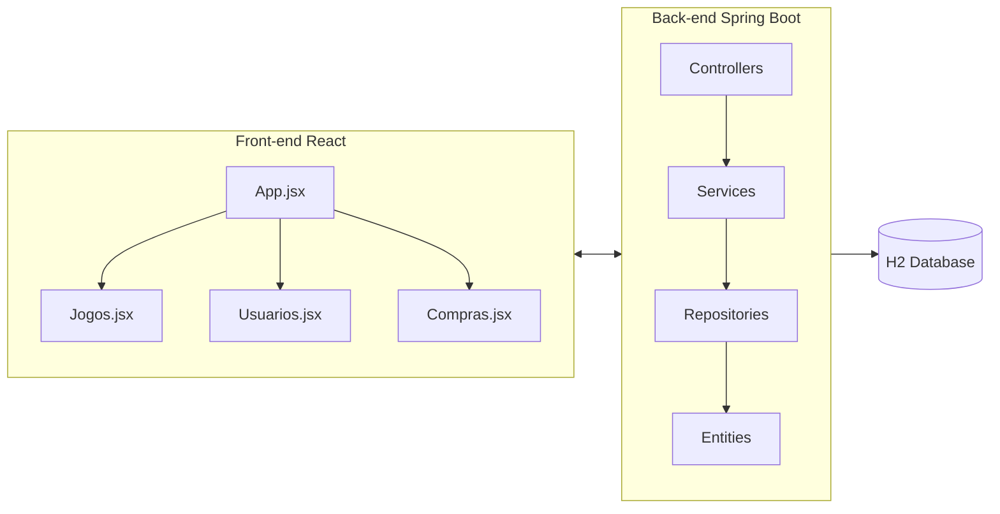
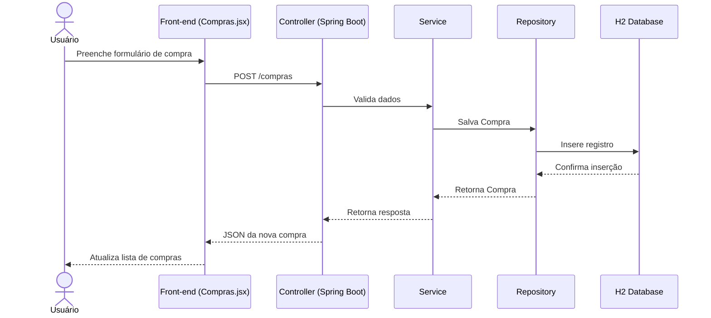

# Projeto-de-Bloco-Engenharia-de-Softwares-Escal-veis-26E2_5-

---

# TP1

## 📖 Visão Geral
Este projeto consiste em uma aplicação de **Loja de Videogames**, desenvolvida com:
- **Back-end:** Spring Boot (Java 21) + Spring Data JPA + H2 Database
- **Front-end:** React (Vite) + CSS customizado
- **Arquitetura:** CRUD completo para Jogos, Usuários e Compras, com suporte a tema claro/escuro no front-end.

---

## 🏗️ Arquitetura da Solução

### Componentes Principais
- **Back-end**
  - `Controllers`: expõem endpoints REST (`/jogos`, `/usuarios`, `/compras`)
  - `Services`: regras de negócio
  - `Repositories`: acesso ao banco via JPA
  - `Entities`: modelos de dados (`Jogo`, `Usuario`, `Compra`)

- **Front-end**
  - `App.jsx`: navegação entre telas e alternância de tema
  - `Jogos.jsx`: CRUD de jogos
  - `Usuarios.jsx`: CRUD de usuários
  - `Compras.jsx`: CRUD de compras (relacionando usuários e jogos)
  - `App.css`: estilos responsivos, com suporte a tema claro/escuro

---

## 📊 Diagrama de Componentes



---

## 📈 Diagrama de Sequência (Exemplo: Cadastro de Compra)



---

## 🎨 Design da Aplicação
- **Separação de responsabilidades:**  
  - Back-end cuida da lógica e persistência  
  - Front-end cuida da experiência do usuário
- **Camadas bem definidas:** Controller → Service → Repository → DB
- **CRUD completo:** Jogos, Usuários e Compras podem ser criados, editados e excluídos
- **Tema claro/escuro persistente:** preferências salvas em `localStorage`
- **DevTools:** reinício automático durante desenvolvimento (desativável em produção)

---

## ⚙️ Instruções de Instalação e Execução

### Back-end
1. Clone o repositório
2. Acesse a pasta do back-end
3. Execute:
   ```bash
   mvn clean install
   mvn spring-boot:run
   ```
4. O servidor estará disponível em `http://localhost:8080`

### Front-end
1. Acesse a pasta do front-end
2. Instale dependências:
   ```bash
   npm install
   ```
3. Execute:
   ```bash
   npm run dev
   ```
4. A aplicação estará disponível em `http://localhost:5173`

---

## 📹 Vídeo de Apresentação

https://youtu.be/JF-V-zpRuDI

---

# TP2

---

## Principais Alterações no Código

1. Criação de TipoUsuario e Plataforma para formalização dos dados.
2. Criação de consultas personalizadas em com Usuario, Jogo e Compra.
3. Adição de @Transactional para as ações que lidam com compra e venda.
4. Adição de FetchType.LAZY em relacionamentos Many para evitar puxar dados desnecessários.
5. Desenvolvimento do histórico no código.
6. Criação de algumas classes de teste para aumentar a robustez do código.
