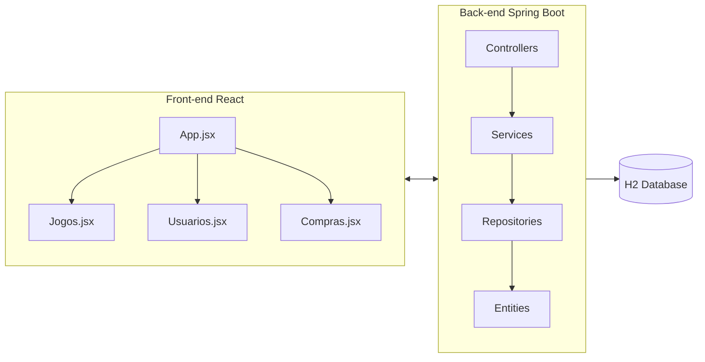
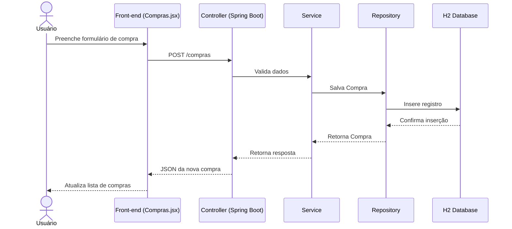
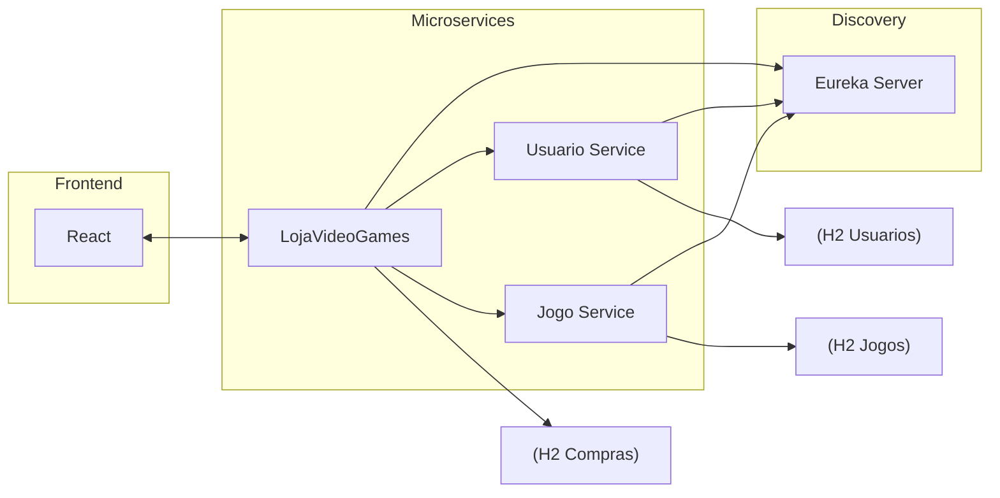
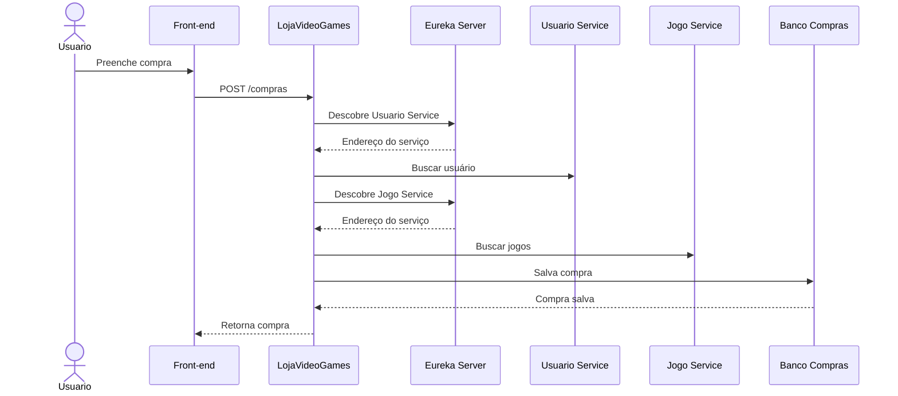

# Projeto-de-Bloco-Engenharia-de-Softwares-Escal-veis-26E2_5-

---

# TP1

## 📖 Visão Geral
Este projeto consiste em uma aplicação de **Loja de Videogames**, desenvolvida com:
- **Back-end:** Spring Boot (Java 21) + Spring Data JPA + H2 Database
- **Front-end:** React (Vite) + CSS customizado
- **Arquitetura:** CRUD completo para Jogos, Usuários e Compras, com suporte a tema claro/escuro no front-end.

---

## 🏗️ Arquitetura da Solução

### Componentes Principais
- **Back-end**
  - `Controllers`: expõem endpoints REST (`/jogos`, `/usuarios`, `/compras`)
  - `Services`: regras de negócio
  - `Repositories`: acesso ao banco via JPA
  - `Entities`: modelos de dados (`Jogo`, `Usuario`, `Compra`)

- **Front-end**
  - `App.jsx`: navegação entre telas e alternância de tema
  - `Jogos.jsx`: CRUD de jogos
  - `Usuarios.jsx`: CRUD de usuários
  - `Compras.jsx`: CRUD de compras (relacionando usuários e jogos)
  - `App.css`: estilos responsivos, com suporte a tema claro/escuro

---

## 📊 Diagrama de Componentes



---

## 📈 Diagrama de Sequência (Exemplo: Cadastro de Compra)



---

## 🎨 Design da Aplicação
- **Separação de responsabilidades:**  
  - Back-end cuida da lógica e persistência  
  - Front-end cuida da experiência do usuário
- **Camadas bem definidas:** Controller → Service → Repository → DB
- **CRUD completo:** Jogos, Usuários e Compras podem ser criados, editados e excluídos
- **Tema claro/escuro persistente:** preferências salvas em `localStorage`
- **DevTools:** reinício automático durante desenvolvimento (desativável em produção)

---

## ⚙️ Instruções de Instalação e Execução

### Back-end
1. Clone o repositório
2. Acesse a pasta do back-end
3. Execute:
   ```bash
   mvn clean install
   mvn spring-boot:run
   ```
4. O servidor estará disponível em `http://localhost:8080`

### Front-end
1. Acesse a pasta do front-end
2. Instale dependências:
   ```bash
   npm install
   ```
3. Execute:
   ```bash
   npm run dev
   ```
4. A aplicação estará disponível em `http://localhost:5173`

---

## 📹 Vídeo de Apresentação

https://youtu.be/JF-V-zpRuDI

---

# TP2

---

## Principais Alterações no Código

1. Criação de TipoUsuario e Plataforma para formalização dos dados.
2. Criação de consultas personalizadas em com Usuario, Jogo e Compra.
3. Adição de @Transactional para as ações que lidam com compra e venda.
4. Adição de FetchType.LAZY em relacionamentos Many para evitar puxar dados desnecessários.
5. Desenvolvimento do histórico no código.
6. Criação de algumas classes de teste para aumentar a robustez do código.

# TP3

---

## Principais Alterações no Código

1. Refatoração da aplicação monolítica para uma arquitetura baseada em microsserviços.
2. Criação do microsserviço usuario-service, responsável pelo gerenciamento de usuários.
3. Criação do microsserviço jogo-service, responsável pelo gerenciamento de jogos.
4. Implementação do Eureka Server para descoberta de serviços.
5. Registro automático dos microsserviços no Eureka.
6. Implementação de clientes REST (UsuarioClient e JogoClient) para comunicação entre serviços.
7. Configuração de Load Balancing através do Spring Cloud LoadBalancer.
8. Separação dos dados em bancos independentes para cada microsserviço.
9. Expansão da cobertura de testes para contemplar os novos serviços.

---

## Atualização do Modelo de Domínio

### Domínios Separados

#### usuario-service

Responsável por: Usuário e TipoUsuário

Principais funcionalidades:
1. Cadastro de usuários
2. Consulta de usuários
3. Busca por e-mail
4. Busca por nome
5. Busca por tipo

#### jogo-service

Responsável por: Jogo e Plataforma

Principais funcionalidades:
1. Cadastro de jogos
2. Consulta de jogos
3. Busca por título
4. Busca por plataforma
5. Busca por preço

#### lojavideogames
Reponsável por: Compra e Histórico

O serviço de compras passou a consumir dados dos microsserviços de usuários e jogos para validação e cálculo do valor total das compras.

---

## Arquitetura da Solução Atualizada

### Componentes Principais

#### Front-end
1. React + Vite
2. Consome a API do sistema

#### Eureka Server
1. Registro e descoberta de serviços

#### Usuario Service
1. Gerenciamento de usuários
2. Banco H2 próprio

#### Jogo Service
1. Gerenciamento de jogos
2. Banco H2 próprio

#### Lojavideogames
1. Gerenciamento de compras
2. Consome os microsserviços
3. Banco H2 próprio

---

## Diagrama de Componentes Atualizado



---

## Diagrama de Sequência Atualizado

### Exemplo: Cadastro de Compra



---

## Novos Endepoints

### Usuario Service

#### Usuários
1. GET /usuarios
2. GET /usuarios/{id}
3. POST /usuarios
4. PUT /usuarios{id}
5. DELETE /usuarios{id}

#### Consultas
1. GET /usuarios/email/{email}
2. GET /usuarios/tipo/{tipo}
3. GET /usuarios/nome/{nome}

---

### Jogo Service

#### Jogos
1. GET /jogos
2. GET /jogos/{id}
3. POST /jogos
4. PUT /jogos/{id}
5. DELETE /jogos/{id}

#### Consultas
1. GET /jogos/plataforma/{plataforma}
2. GET /jogos/titulo/{titulo}
3. GET /jogos/preco/{preco}

---

## Integração Entre Serviços
A comunicação entre serviços é realizada utilizando:

1. Spring Cloud Eureka
2. Spring Cloud LoadBalancer
3. RestTemplate

### Fluxo:

CompraService
    |
    +--> UsuarioClient
    |         |
    |         +--> USUARIO-SERVICE
    |
    +--> JogoClient
              |
              +--> JOGO-SERVICE

---

## Testes

### lojavideogames
1. CompraServiceTest

### usuario-service
1. UsuarioServiceTest
2. UsuarioRepositoryTest

### jogo-service
1. JogoServiceTest
2. JogoRepositoryTest
